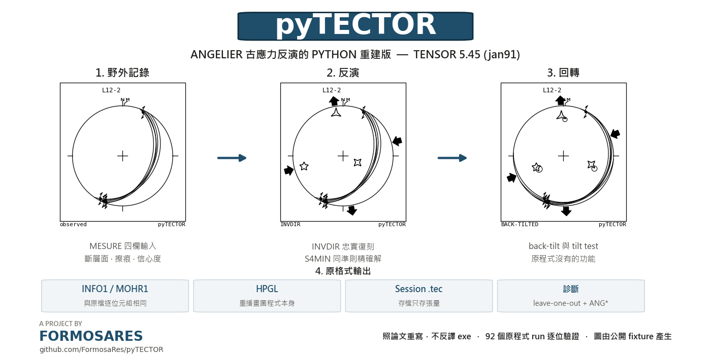
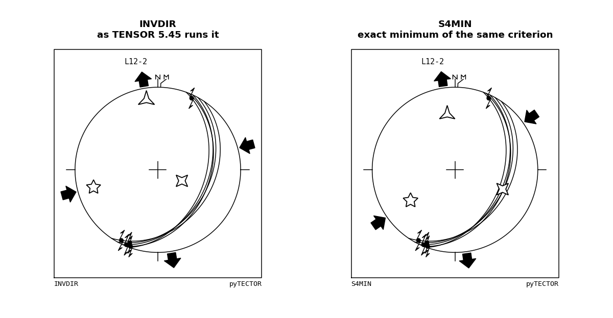
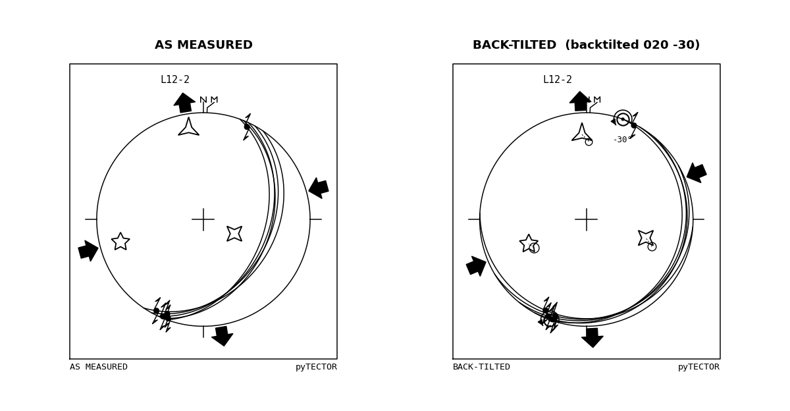
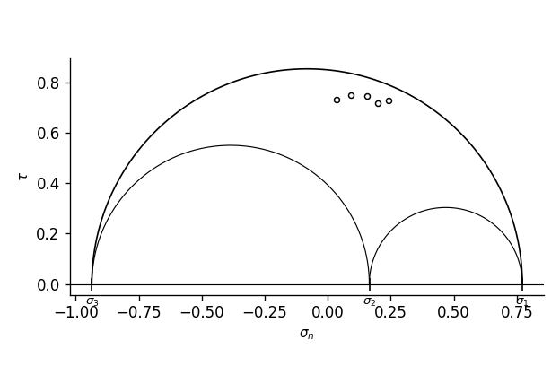

<div align="right">

[English](README.md) | [繁體中文](README.zh.md)

</div>

<div align="center">



**A Python reconstruction of Angelier's palaeostress inversion, matching TENSOR 5.45 (jan91)**

Rebuilt from the published method, and checked against the original program's own output

[](docs/mesure_oracle.md)
[](pyproject.toml)
[](#quick-start)
[](tests/)
[](LICENSE)

[English manual](docs/manual.en.md) · [使用手冊 中文](docs/manual.zh.md) · [Transcript of the original program](docs/mesure_oracle.md)

</div>

---

## What this is

Angelier's direct inversion method takes a set of measured fault planes and
slickenside lineations and returns the reduced stress tensor that best explains
them: the three principal stress directions and the shape ratio Φ. His program
`Tensor.exe` did this from 1991 onwards and a great deal of published
palaeostress work rests on it.

pyTECTOR performs the same arithmetic, reads and writes the same files, draws
the same diagrams, and adds the parts the original never had: back-tilting, a
tilt test, and a second run that minimises the same criterion exactly, so that
how much of an answer comes from the method rather than from the data can be
assessed.

The project name is Angelier's own. TECTOR is what he called the program's
tectonic-orientation data base, and it appears on every INFO1 the program wrote.

---

## Interface

| The two runs side by side | Back-tilting and the tilt test |
|---|---|
|  |  |

<div align="center"></div>

> All of the images above are produced from the public fixture
> `tests/fixtures/L12-2/` in this repository. That site is synthetic rather than
> field data, so every figure here can be reproduced independently.

---

## Features

**How it was rebuilt.** The algorithm is fully published in Angelier (1984,
1990), so this is an implementation from those papers. The original 16-bit
executable was not disassembled.

**Verification.** Ninety-two runs produced by the original program serve as the
regression set. The forward model (SIGMN, TAU, TAUST, RUP, ANG) matches record
by record to the precision of the files themselves. Re-running the inversion at
each site's recorded pass count and LAMBDA, 85 of the 90 comparable sites agree
on all three axes to within 3°.

**Two runs, INVDIR and S4MIN.** The first is Angelier's method as the original
program runs it; the second is the exact minimum of the same criterion. Neither
should be read as the true stress: the υ criterion carries a systematic bias,
and even on noise-free synthetic data the result sits about 4° from the true
tensor. They are shown together to make the difference visible, not so that one
can be chosen over the other.

**Back-tilting and the tilt test.** Neither was in the original program. The
angle is adjusted on a slider and σ₁, σ₂ and σ₃ are recomputed as it moves. For
INVDIR, the difference between the axes before and after a rotation reflects a
property of the method rather than anything geological: across 14 archive pairs
the measured median σ₁ difference is 10.4°.

**Influence diagnostics.** The data that fit worst and the data that determine
the answer are not necessarily the same records. Each datum is removed in turn
and the inversion repeated, giving the leave-one-out residuals ANG\* and RUP\*.
Both the all-data and the leave-one-out results are written side by side into
the exported INFO1.

**Output in the original formats.** INFO1 and MOHR1 are byte-for-byte identical
to the originals. The HPGL export replays the original drawing procedure rather
than reimplementing it.

**Session files.** The whole working state is saved as a single JSON file.
Only the tensor is stored and everything else is recomputed on load, so a saved
Φ cannot contradict the saved tensor.

---

## Provenance

The algorithm is fully published, so this was rebuilt from the papers rather
than by decompiling the 16-bit original: compilation had discarded the names,
the types and the structure, and segmented addressing makes pointers
unresolvable. The work went into reading Angelier (1984, 1990, 1994) and into
measuring the original's own output for everything the papers do not state.

The name is Angelier's too. His papers never name a program, but the binary
names itself in every INFO1 it wrote, and one of the two names on that banner
is **TECTOR**, its tectonic-orientation data base. "TENSOR" was unavailable:
in this field it now means Delvaux's unrelated Win-Tensor, and on PyPI
`pytensor` is PyMC's array library.

Both questions in full, with the banner text and the references:
**[docs/background.en.md](docs/background.en.md)**.

## Quick start

One-click on Windows: download the repository, double-click **`install.bat`**.
It finds a Python (Anaconda first), installs numpy, scipy, matplotlib and
PyQt5, and puts a pyTECTOR shortcut on the desktop. Alternatively
`pip install .` (or `pip install git+https://github.com/FormosaRes/pyTECTOR`)
installs a `pytector` command.

```
pyTECTOR.bat                           desktop interface (Windows)
./pyTECTOR.command                     desktop interface (macOS, Linux)
python demo_report.py [site file]      invert an old site, print INFO1 + MOHR1
python run_batch.py [root] [out.csv]   both runs over a whole folder tree
python make_survey.py [root] [outdir]  table, map data and a rose per phase
```

**macOS and Linux.** Nothing in the library is Windows-specific, so the
inversion, the file readers and the exports all run unchanged. Install the four
dependencies and use `pyTECTOR.command`, which is double-clickable in Finder:

```
python3 -m pip install numpy scipy matplotlib PyQt5
./pyTECTOR.command
```

Two things to know. On an **Apple Silicon** Mac, PyQt5 needs a release with an
arm64 wheel (5.15.10 or newer); if pip starts compiling Qt from source, install
it through conda instead (`conda install -c conda-forge pyqt`). And set
`PYTECTOR_PYTHON` if the launcher should use a particular interpreter rather
than the first one on `PATH` that can import PyQt5. The interface has not been
tested on macOS: the font stacks name macOS and Linux faces so the fixed-width
tables stay aligned, but reports of anything that looks wrong are welcome.

The full interface walkthrough, control by control, is in
**[docs/manual.en.md](docs/manual.en.md)**.

Type a fault in four fields and watch it land on the stereogram:

```
CS - 122 - 87W - 124
|    |     |     |
|    |     |     +-- pitch and quadrant (62N), or a bare trend (124)
|    |     +-------- dip and its quadrant
|    +-------------- strike
+------------------- confidence C/P/S  +  movement I/N/S/D
```

Or open an old run directly: point it at the extension-less data file named
after the site, for example `L12`, and everything loads, INFO1 and all.

## The criterion

| | |
|---|---|
| stress vector | σ = **T**·n  (eq 3) |
| shear traction | τ = σ − (n·σ)n  (eq 4-5) |
| upsilon vector | λs = τ + υ  (eq 12) |
| **objective** | **υ² = λ² + \|τ\|² − 2λ(s·σ)**  (eq A1), minimise **S₄ = Συ²** (eq 13) |
| quality | RUP = 100·\|υ\|/(√3/2), 0-200 % ; ANG = angle(s, τ), 0-180° |

The reduced stress tensor is normalised so that the **sum of squared
eigenvalues is 3/2** (eq A16), not so that σ₁ − σ₃ is fixed. The two agree only
at Φ = 0.5, and the criterion is not scale invariant, so this matters.

**The criterion is biased, and that is not a bug in anyone's code.** υ asks for
two things at once: that the predicted shear points along the observed slip,
and that its magnitude is close to λ. Fed perfect Bott data with no noise at
all, it still misses the true tensor by about 4 degrees, because it favours
orientations that put high shear on the faults. The angle-only criterion F2
recovers the same data to 0.00 degrees. This is the root of why TectonicsFP and
similar programs disagree with Angelier's numbers.

## Two runs: INVDIR and S4MIN

Named after what they are, not by a letter that would imply one is better.
**Neither is "the true stress"**, for the reason above.

### INVDIR

`pytector.invdir`, code `INVD`, as TENSOR 5.45 runs it.

Uses Angelier's own (α, β, γ, ψ) parametrisation, equation (14), printed as
(A2) in the appendix:

```
T = [[cos ψ,  α,            γ          ],
     [α,      cos(ψ+2π/3),  β          ],
     [γ,      β,            cos(ψ+4π/3)]]
```

This tensor is **not** normalised: its entries square to 3/2 + 2(α²+β²+γ²), so
its maximum shear moves as the solution moves. That is exactly why λ has to be
re-adjusted over successive passes, and why the `LAMBDA` printed in INFO1 comes
out smaller than √3/2. The pipeline is:

1. **INVDIR pass k**: minimise S₄ at the current λ, then set λ to the taumax of
   the result. The `(NO k)` printed in INFO1 **is the pass number**, not a
   choice between two solutions.
2. **PSIDIR**: freeze the axes, switch to the normalised A16 form, λ = √3/2, and
   re-minimise over ψ across a **full turn**. This fixes Φ and repairs the
   artificial σ₁/σ₃ permutations the unnormalised pass can produce.

Two points are relevant to any reimplementation. υ² is *quadratic* in (α, β, γ)
at fixed ψ, so the inner minimisation is an exact 3×3 linear solve; Angelier's
Appendix I and II perform that expansion by hand, and the polynomials are
regenerated numerically here because the appendix is illegible in the available
scan. Second, ψ must be scanned over the whole circle: restricting it to
[0, π/3] yields Φ = 0 and the wrong axes, because the minimum often sits near
ψ = 336-353°.

### S4MIN

`pytector.modern`, code `S4MN`, the exact minimum of the same S₄.

Eigen-decomposition parametrisation, so λ is the constant √3/2 by construction
and no adjustment loop is needed; the search is global. It reaches a lower S₄ on
**all 92 archive sites**, without exception:

| site | INVDIR S₄ | S4MIN S₄ |
|---|---|---|
| L12 | 0.3018 | 0.2360 |
| 0406-7 | 7.6198 | 7.3201 |

So the original program does not reach the minimum of its own criterion, because
λ stops before it converges.

### Going further

The two runs, PSIDIR's axis relabelling, what λ actually is, why the iteration
diverges, how to read convergence off an INFO1, and the equivariance data
behind the back-tilt warning above are all set out in
**[docs/method.en.md](docs/method.en.md)**.

File formats, the HPGL drawing reference and the repository layout are in
**[docs/formats.en.md](docs/formats.en.md)**.

## Back-tilting

Back-tilting has a window of its own, opened from the toolbar. The main window
shows the data as measured and nothing else, so a stereogram there never needs a
caption to say which orientation it is in.

The window rotates the data, inverts both states, and shows them side by side:
measured on the left, restored on the right, with the numbers for both
underneath. Three ways to set the rotation:

| mode | input | what it does |
|---|---|---|
| reference surface | strike / dip, or its pole as trend / plunge | the rotation that restores that surface to horizontal |
| rotation axis | trend / plunge / angle | applies it directly, right-hand rule |
| partial | 0 to 125 % | any fraction of either of the above |

Both the fault normals and the slip vectors are rotated, so rakes and senses
carry through. The convention was fixed against the archive rather than assumed:
solving for the rotation between an original site and its back-tilted copy
(Kabsch on the fault normals) reproduces all seven cases to better than 2°.

Reference surfaces are drawn as dashed great circles with their poles, and they
rotate with the data, so a correct restoration is visible: the dashed circle
flattens onto the primitive and the pole walks in to the centre.

**The angle is not computed.** There is no analytical solution for it. It is
found by trying values and looking at the result, which is why the archive
folders are named after what was tried, `(backtilted 020 -20)`. This only makes
trying fast and keeps the rotation in force visible. Choosing the reference
surface, and the angle, stay with the user.

## Surveying many runs

A single inversion answers one site. The question a study actually asks is what
a whole set of them says, which is what `make_survey.py` and `pytector.survey`
are for. Point them at a tree of TENSOR run folders and they produce a table of
every solution, the fault data behind them, map-ready points as CSV and
GeoJSON, and an axial rose for each deformation phase.

Two side files are optional and are yours: a CSV of `run,stage` saying which
run belongs to which phase, and a CSV of `site,longitude,latitude`. Which phase
a determination belongs to is a judgement, and nothing here guesses it.

The rose diagrams are axial rather than directional, because a stress axis has
no arrowhead: 020 and 200 are the same line, so the doubled-angle method is
used and the two ends reinforce instead of cancelling. A trend is only treated
as a direction when its axis is shallow; steeper axes are dropped and the count
of what was dropped is printed on the figure rather than left implicit. See
`pytector/rose.py` for both decisions in full.

## Verification

Eleven test files, all passing. They read the original archive when it is
available and skip rather than fail when it is not.

They cover the whole pipeline against both the original program's output and
the public fixture, the INFO1 and MOHR1 layouts, the typed-record parsing, the
back-tilt convention, the equivariance result, the influence diagnostics, the
axial statistics and the session round-trip. See [`tests/`](tests/) for what
each one pins.

Site 0406-7, 29 faults with dips from 42 to 89°, is the site that pins the
algorithm down:

```
forward model vs MOHR1   max |SIGMN| 0.001  |TAU| 0.001  |TAUST| 0.001
                         max |RUP|   0.099  |ANG| 0.113
INVDIR pipeline          sigma1 0.047 deg   sigma2 0.020   sigma3 0.032
                         Phi 0.138 (file 0.138)
                         mean ANG 20.898 (20.900)   mean RUP 54.097 (54.100)
                         LAMBDA printed 0.682 (0.680)
```

Site L12, six near-parallel and near-vertical planes, is degenerate and
reproduces less tightly, axes to about 1° and mean RUP within 0.6 per cent.
Tolerances are set per site to reflect that rather than being loosened globally.

No Qt object is ever constructed in a test: a QApplication started from an
automated shell pops a platform-plugin dialog and exits. What the tests do
instead is verify the contract between the interface and the library.

## The reference archive

Tests and the derivation scripts read real output from the original program.
That is unpublished field data, so its location is not baked into the source:

```
set PYTECTOR_ARCHIVE=<folder holding the TENSOR run folders>     REM Windows
export PYTECTOR_ARCHIVE=<folder holding the TENSOR run folders>  # macOS, Linux
```

Without it, those tests skip rather than fail. The data itself is not
distributed with this repository.

## Licence, credits and use

The code in this repository is released under the **MIT Licence**; see
[LICENSE](LICENSE). If it contributes to published work, a citation of this
repository alongside Angelier's own papers is appreciated but not required.

Three things the licence does not cover, because they are not this project's to
license:

- **The method** is Jacques Angelier's, set out in the papers cited above. This
  is an independent reimplementation from those papers, plus measurements taken
  from output files his program wrote; no code was taken from the original
  binary.
- **The reference archive** is unpublished field data. It is not distributed
  here and is not covered by this licence (see *The reference archive*).
- **The opening screen** is Angelier's own block diagram of the Taiwan
  arc-continent collision. He used earthquake focal mechanisms from near Yuli as
  the worked example of applying this method to seismological data (1994,
  fig. 4.44). That image is a published figure and is **not** committed here, so
  a fresh clone starts without an opening screen and without the easter egg
  behind it. Placing `Taiwan Tectonic Map.jpg` in the repository root restores
  both, for local use only.

Maintainer: Chi-Hsiu Pang.

## Still open

- writing TENSOR-format data files back out (the site-header fields are now
  known, see [docs/mesure_oracle.md](docs/mesure_oracle.md))
- R4DT / R4DS / R2DT / R2DS, Angelier's iterative-search methods,
  deliberately not started (TENSOR's own help documents them, see
  docs/mesure_oracle.md)

## Changelog

See **[CHANGELOG.md](CHANGELOG.md)**.
